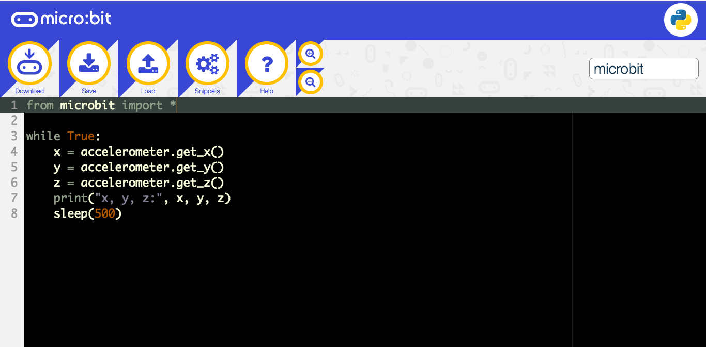

# The Accelerometer on a Microbit Introduction
What I have learned throughout this entire process of the Accelerometer on the microbit is that you can do it through a different methods. For one you can use just the blocks which are very simple quite full on easier to use and understand the idea of inputing the many different specific functions that can alter the operation of the microbit. Then it outputs the result from what you delivered via the code. Despite using the simple method of using blocks and picking the functions that can easily operate the microbit, you can use Python Code which is more of a professional way to enable the functions of the microcontroller. 
    
  Here is the python code to operate the microcontroller 
 
 
 # What is it used for?
 When using the Microbit, once the light detection is delivered, it automatically situates itself in a different position   because when the microcontroller tilts or turns you can move the light any place. Especially when it comes to moving it around or upside down, it will still continue to move because of the detection of the microbit movement. 
 
 Here is an example of how it can travel to a space 
 
 
 
 Another note there are 3 axis which play a different role and contain opposite traits, for the Z axis moves up and down, whilst X tiles from left to right and Y which tilts fowards and backwards
 
 
 
